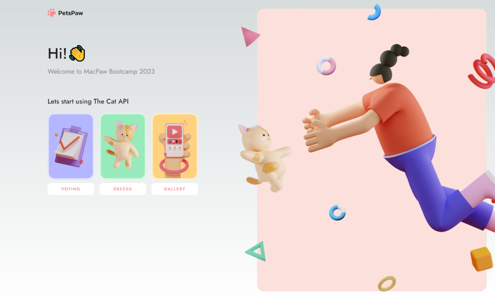
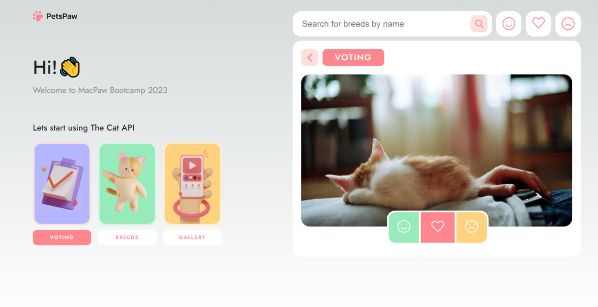
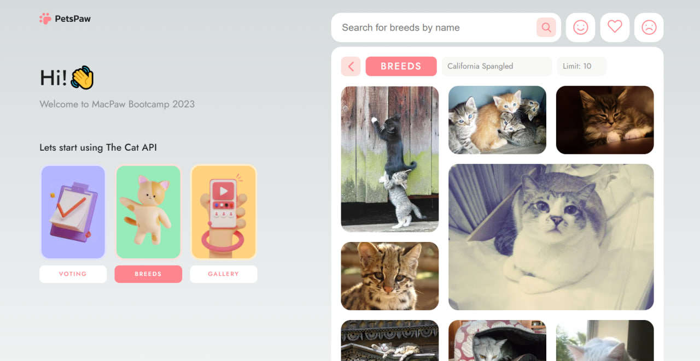
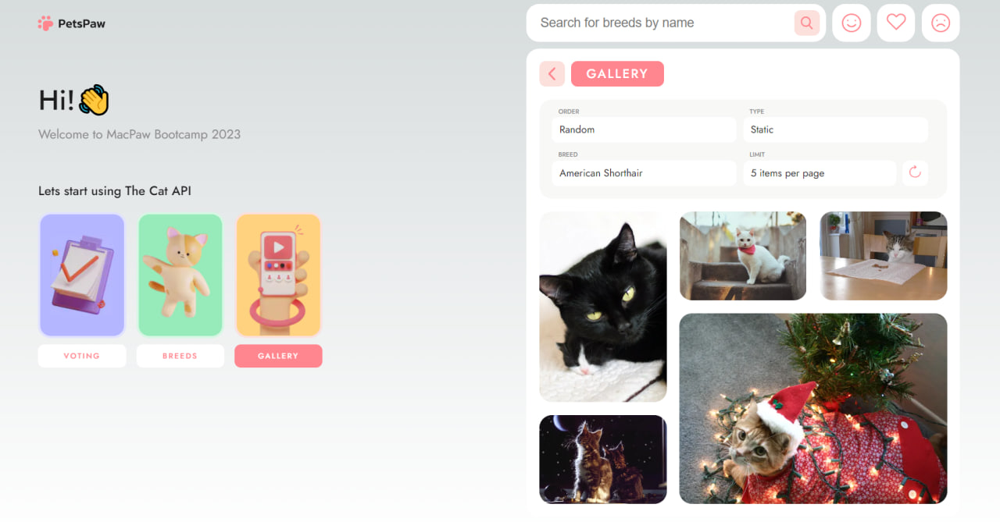
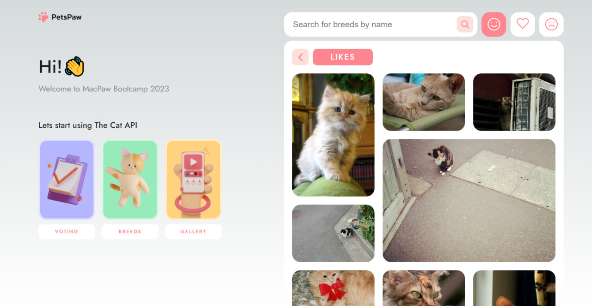
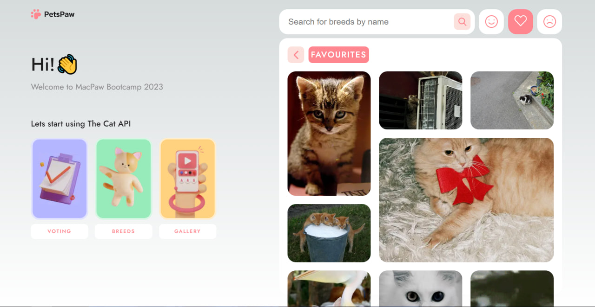
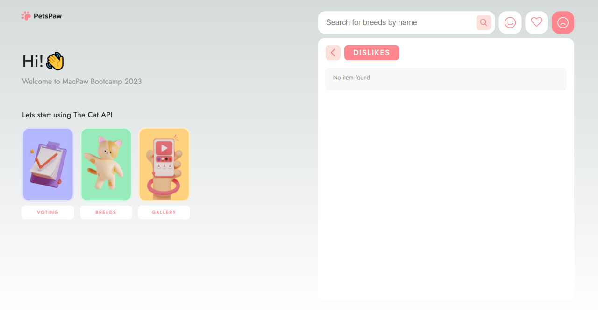

## PetsPaw

This project bootstrapped with [`create-next-app`](https://github.com/vercel/next.js/tree/canary/packages/create-next-app).

This project is for you if you love cats. It uses the Cat API and offers you beautiful cat photos, the ability to create a page of favorite photos, photos that you like.

From the main page, you can go to the Voting, Breeds and Gallery pages by clicking on the corresponding buttons.

On the Voting page, you can add a photo to your favorites or to the photos you like or to the photos you don't like.

You can go to each of these pages (Favorites, Likes, Dislikes) and see the attached cat photos.

On the Breeds page you can filter photos by breed, you can choose how many photos will be displayed on the page.

On the Gallery page, in addition to filtering by breed and by the number of photos displayed on the page, you can also filter photos by their upload date (RANDOM, ASC or DESC) and by type (gif, jpg, png).
Also, the gallery contains a button, by clicking on which you can download new additional photos.

  
  
  
  
  
  
  

